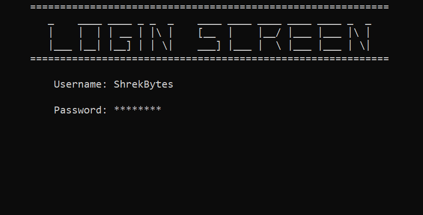

# Hospital Management

This hospital management project aims to simplify patient information management through an innovative and user-friendly interface, enhancing the efficiency of hospital processes. The project was developed using the C language and incorporates data structures for effective data management.

## Default Credentials 🔐
- Username: ShrekBytes
- Password: asdf1234

## Table of Contents
- [Features](#features)
- [Screenshots](#screenshots)
- [Dependencies](#dependencies)
- [Contributing](#contributing)
- [License](#license)

## Features
- Clears output screen with loading animation.
- Login screen with username and password validation.
- Main menu with options to view all patients, add a new patient, and search for a specific patient.
- Add new patients to the system, including information such as name, age, gender, blood group, and contact details.
- Display a list of all patients with their respective patient numbers.
- Search for a patient by their name using fuzzy search, which allows for approximate matching.
- Each patient has a unique patient number assigned to them.
- Patient information includes their name, age, gender, blood group, contact details, emergency contact information, current physician, and date of admission.

## Screenshots
Here are some screenshots showcasing the project's user interface:

|  |  |
|:---:|:---:|
|  |  |
|  |  |
|  |  |
|  |  |
|  | |

## Dependencies
- The application requires a C compiler to compile and run the source code.
- The code has been tested on both Windows and Linux systems.

## Contributing

Contributions to this project is not currently open. It is intended solely for showcasing the project I did for university task.

However, if you have any suggestions, feedback, or questions, feel free to open an issue in the repository. I appreciate your interest and input!

## License

"License? Nah, who needs those bothersome regulations anyway? Feel free to do whatever you want with this code – use it as a doorstop, launch it into space, or frame it as a modern art masterpiece. Just don't blame me if things get a little wild!"

###

Happy exploring and learning! 🚀🎓
